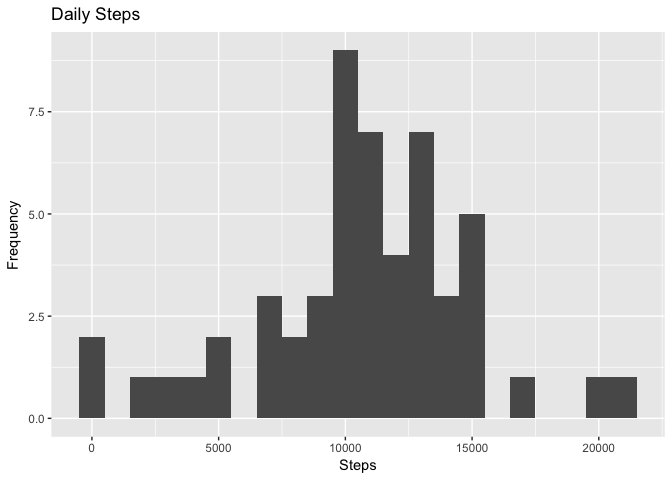
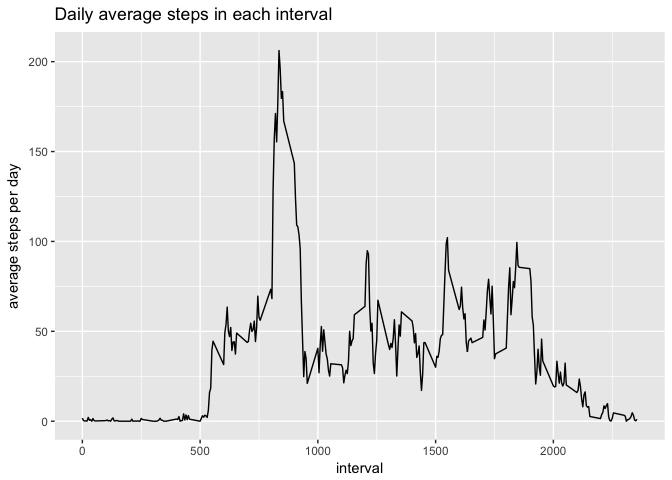
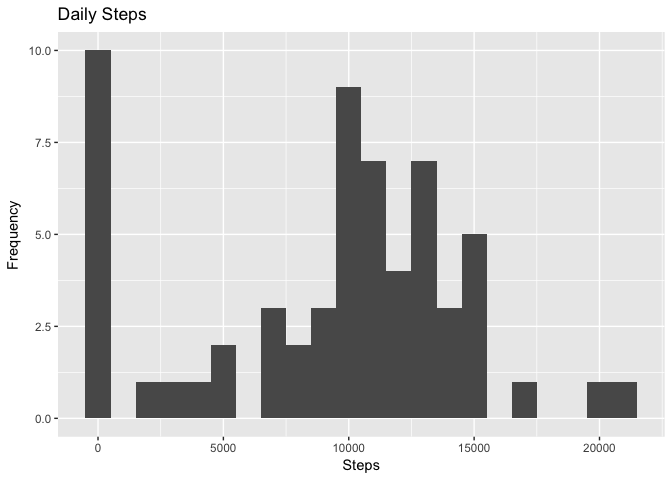
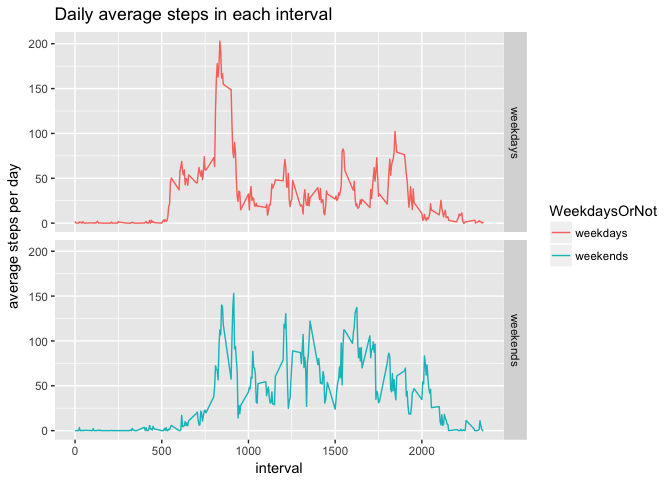

## Loading and preprocessing the data

```r
unzip(zipfile = "activity.zip")
data <- read.csv("activity.csv", header = TRUE, sep = ",")
data$interval <- as.factor(data$interval)
```
The first 6 lines of the loaded data looks like:

```r
head(data)
```

```
##   steps       date interval
## 1    NA 2012-10-01        0
## 2    NA 2012-10-01        5
## 3    NA 2012-10-01       10
## 4    NA 2012-10-01       15
## 5    NA 2012-10-01       20
## 6    NA 2012-10-01       25
```
## What is mean total number of steps taken per day?
For this part, ignore the missing values in the dataset.

1. Calculate the total number of steps taken per day

```r
StepsPerDay <- tapply(data$steps, data$date, sum)
TotalStepsPerDay <- data.frame(date = unique(data$date),steps = StepsPerDay)
rownames(TotalStepsPerDay) <- seq_along(TotalStepsPerDay$steps)
```
The total number of steps taken for the first few days are:

```r
head(TotalStepsPerDay)
```

```
##         date steps
## 1 2012-10-01    NA
## 2 2012-10-02   126
## 3 2012-10-03 11352
## 4 2012-10-04 12116
## 5 2012-10-05 13294
## 6 2012-10-06 15420
```
2. Make a histogram of the total number of steps taken each day

```r
library(ggplot2)
ggplot(TotalStepsPerDay, aes(x = steps)) + geom_histogram( binwidth = 1000) + labs(title = "Daily Steps", x = "Steps", y = "Frequency")
```

```
## Warning: Removed 8 rows containing non-finite values (stat_bin).
```

<!-- -->

3. Calculate and report the mean and median of the total number of steps taken per day

```r
options(scipen=10)
MedianOfSteps <- median(TotalStepsPerDay$steps,na.rm = TRUE)
MeanOfSteps <-round(mean(TotalStepsPerDay$steps,na.rm = TRUE),2)
```
The median of the total number of steps taken per day is 10765.  
The mean of the total number of steps taken per day is 10766.19.

## What is the average daily activity pattern?

1. Make a time series plot (i.e. 𝚝𝚢𝚙𝚎 = "𝚕") of the 5-minute interval (x-axis) and the average number of steps taken, averaged across all days (y-axis)

```r
IntervalSteps <- tapply(data$steps, data$interval, mean, na.rm = TRUE)
AvgStepsPerDay <- data.frame(interval =  unique(data$interval), steps = IntervalSteps)
AvgStepsPerDay$interval <- as.numeric(as.character(AvgStepsPerDay$interval))
rownames(AvgStepsPerDay) <- seq_along(AvgStepsPerDay$steps)

ggplot(AvgStepsPerDay,aes(x=interval, y=steps)) + geom_line() + labs(title = "Daily average steps in each interval", x = "interval", y = "average steps per day")
```

<!-- -->

The average steps in the first several interval across all days are:

```r
head(AvgStepsPerDay)
```

```
##   interval     steps
## 1        0 1.7169811
## 2        5 0.3396226
## 3       10 0.1320755
## 4       15 0.1509434
## 5       20 0.0754717
## 6       25 2.0943396
```

2. Which 5-minute interval, on average across all the days in the dataset, contains the maximum number of steps?  

```r
max <- round(AvgStepsPerDay[which.max(AvgStepsPerDay$steps),],2)
```
So the maximum number of steps is 206.17.  

## Imputing missing values  
1. Calculate and report the total number of missing values in the dataset (i.e. the total number of rows with 𝙽𝙰s)

```r
nrow <- nrow(data[is.na(data$steps),])
```
The total number of missing values in the dataset is 2304.  

2. Create a new dataset that is equal to the original dataset but with the missing data filled in with the median value of the day.  

```r
newData <- data.frame(data)
newData[is.na(newData$steps),]$steps <- median(newData$steps, na.rm = TRUE)
```
The first several data in the new dataset are:

```r
head(newData)
```

```
##   steps       date interval
## 1     0 2012-10-01        0
## 2     0 2012-10-01        5
## 3     0 2012-10-01       10
## 4     0 2012-10-01       15
## 5     0 2012-10-01       20
## 6     0 2012-10-01       25
```

3. Make a histogram of the total number of steps taken each day and Calculate and report the mean and median total number of steps taken per day.  

```r
NewStepsPerDay <- tapply(newData$steps, newData$date, sum)
NewTotalStepsPerDay <- data.frame(date = unique(newData$date),steps = NewStepsPerDay)
rownames(NewTotalStepsPerDay) <- seq_along(NewTotalStepsPerDay$steps)
```

The first 6 lines of the new dataset looks like with missing value filled with median value of the day are:  

```r
head(NewTotalStepsPerDay)
```

```
##         date steps
## 1 2012-10-01     0
## 2 2012-10-02   126
## 3 2012-10-03 11352
## 4 2012-10-04 12116
## 5 2012-10-05 13294
## 6 2012-10-06 15420
```

The histogram of the total number of steps taken each day:

```r
ggplot(NewTotalStepsPerDay, aes(x = steps)) + geom_histogram( binwidth = 1000) + labs(title = "Daily Steps", x = "Steps", y = "Frequency")
```

<!-- -->

We can see that the values at 0 here is different from the the first part of the assignment. Because we filled the missing value with the median value of of the day, which is 0. All the missing value are replaced by 0 in this case, which causes the value  at 0 in this histogram increase a lot.  

## Are there differences in activity patterns between weekdays and weekends?
1. Create a new factor variable in the dataset with two levels – “weekday” and “weekend” indicating whether a given date is a weekday or weekend day.

```r
newData$date <- strptime(as.character(newData$date), "%Y-%m-%d")
newData$WeekdaysOrNot <- ifelse(weekdays(newData$date) %in% c("Saturday", "Sunday"), "Weekends","Weekdays")
newData$weekdays <- as.factor(newData$WeekdaysOrNot)
```
The first 6 lines of the newData with weekdays indicator are:

```r
head(newData)
```

```
##   steps       date interval WeekdaysOrNot weekdays
## 1     0 2012-10-01        0      Weekdays Weekdays
## 2     0 2012-10-01        5      Weekdays Weekdays
## 3     0 2012-10-01       10      Weekdays Weekdays
## 4     0 2012-10-01       15      Weekdays Weekdays
## 5     0 2012-10-01       20      Weekdays Weekdays
## 6     0 2012-10-01       25      Weekdays Weekdays
```

2. Make a panel plot containing a time series plot (i.e. 𝚝𝚢𝚙𝚎 = "𝚕") of the 5-minute interval (x-axis) and the average number of steps taken, averaged across all weekday days or weekend days (y-axis).   

```r
SubWeekdays <- subset(newData, WeekdaysOrNot == "Weekdays")
IntervalStepsWeekdays <- tapply(SubWeekdays$steps, SubWeekdays$interval, mean)
SubWeekdaysDF <- data.frame(interval = unique(newData$interval), steps = IntervalStepsWeekdays, WeekdaysOrNot = "weekdays")

SubWeekends <- subset(newData, WeekdaysOrNot == "Weekends")
IntervalStepsWeekends <- tapply(SubWeekends$steps, SubWeekends$interval, mean)
SubWeekendsDF <- data.frame(interval = unique(newData$interval), steps = IntervalStepsWeekends, WeekdaysOrNot = "weekends")

total <- rbind(SubWeekdaysDF, SubWeekendsDF)
total$interval <- as.numeric(as.character(total$interval))

ggplot(total,aes(interval,steps,col = WeekdaysOrNot)) + geom_line() + facet_grid(WeekdaysOrNot ~ .) + labs(title = "Daily average steps in each interval", x = "interval", y = "average steps per day")
```

<!-- -->
